<h1 align="center">New Super Lucky's Tale(DirectX11, 개인 프로젝트)</h1>

   (출처: 에픽게임즈)

---
## 프로젝트 소개
본 프로젝트는 DirectX11 기반 자체 엔진으로 구현한 New Super Lucky's Tale 모작 포트폴리오입니다.
단순히 플레이 장면을 재현하는 수준을 넘어, 

**[ 게임의 구조적 분석 / 핵심 시스템 설계 / 직접 구현 ]** 까지 경험하면서 게임 클라이언트 개발 전반의 이해를 목표로 삼으며 프로젝트를 진행했습니다.

---

## 제작기간
**약 2개월 (2024/06 ~ 2024/08)**

   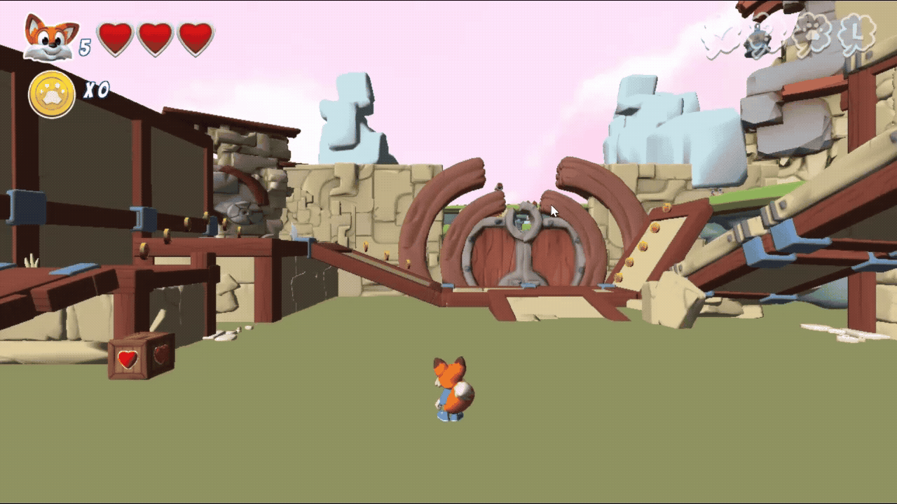

## Characters

   
   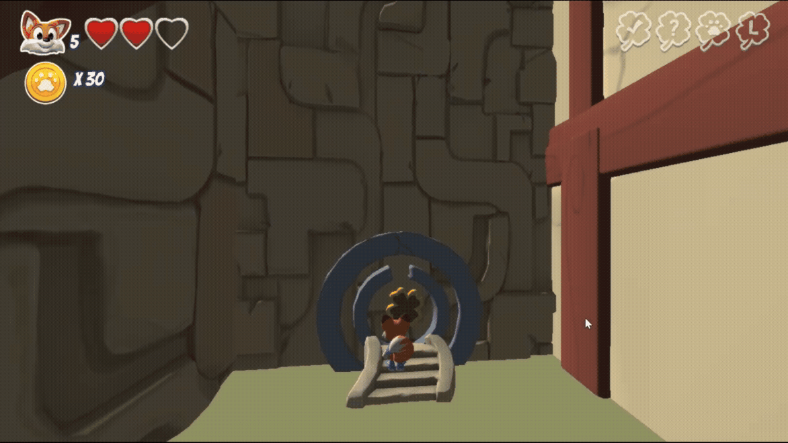
   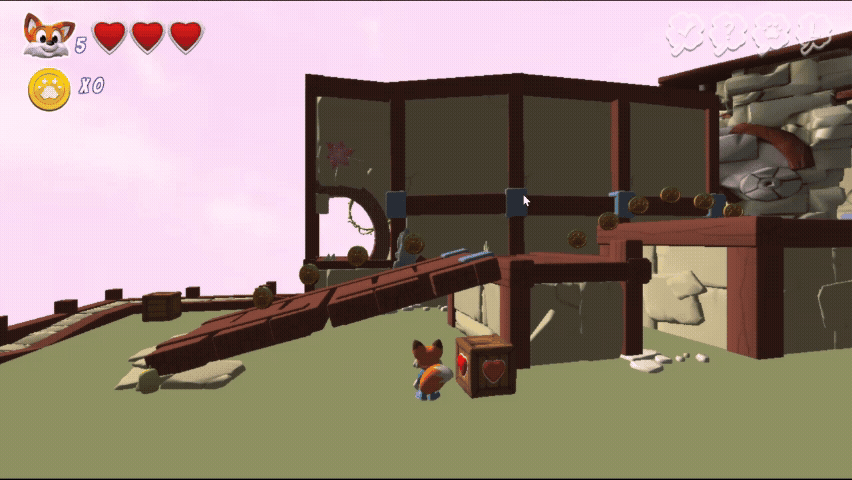
   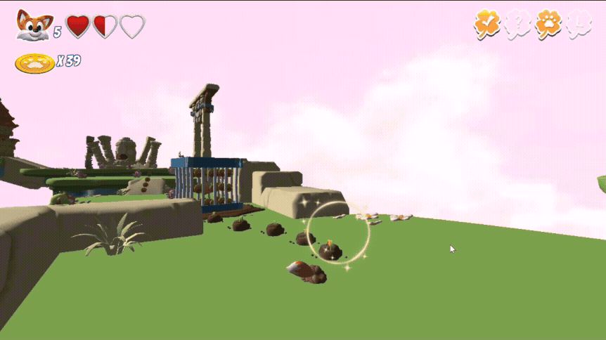

- **수집 및 루트 시스템**: 코인 및 클로버 수집, UI 연동을 통한 직관적 피드백 제공  
- **캐릭터 핵심 조작**: 이동, 점프, 공격 등 기본 메커니즘 구현  
- **플레이어 공격**: 충돌 감지 및 물리 기반 피격 피드백  
- **아이템 상호작용**: Burrow Mode로 지면 내 아이템 수집 가능  

   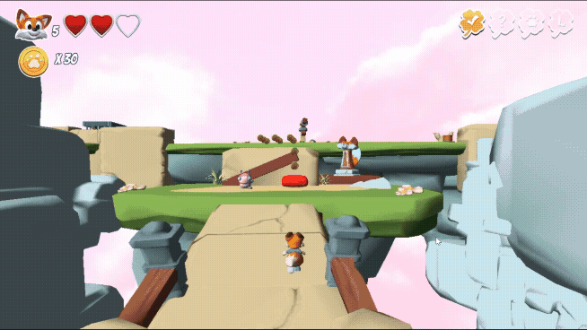

- **전투 로직**:  
  - Player 1차 공격 시 몬스터는 첫 번째 애니메이션 (어지러움 후 회복) 재생  
  - Player 2차 공격 시 포물선 공식 기반 넉백 후 몬스터 Dead 처리 (두 번째 애니메이션)

   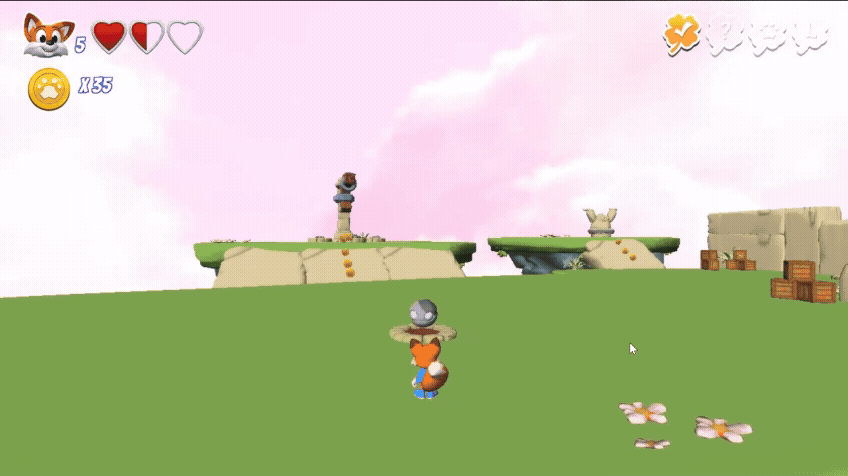
   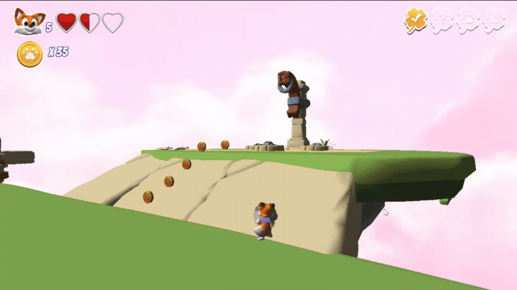

- **퀘스트 메커니즘** : 분리된 GolemHead 수집 후 Player PartObject(Hand)와 연결/해제하는 연출 구현

---
## Map Tool (ImGui 기반)

   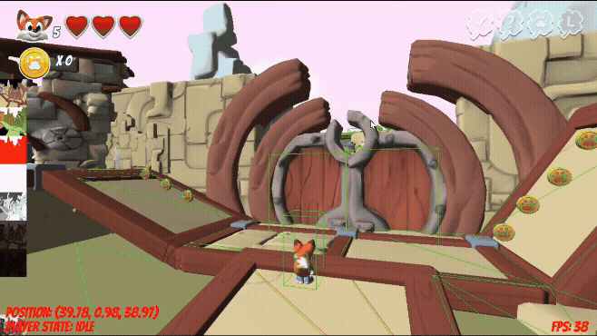

- **Renderer Debug Mode**: Diffuse, Normal, Depth, LightDepth, Shade, Blur, Result 뷰 지원

   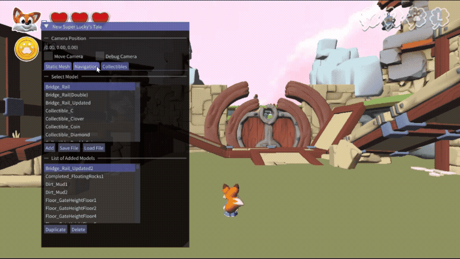

   
- **디버그 카메라(Debug Camera)**: 개발 편의를 위한 자유 시점 카메라 제공

  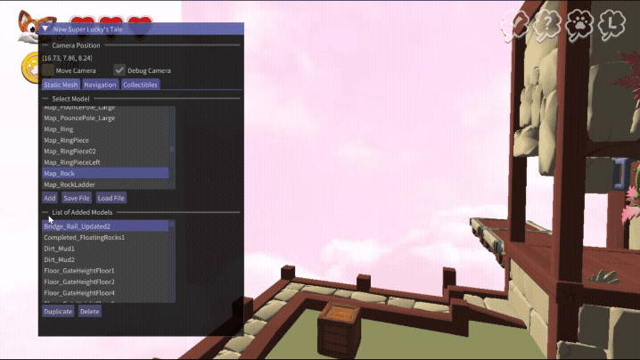
   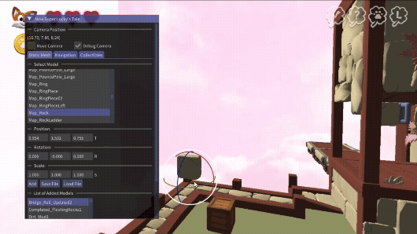
   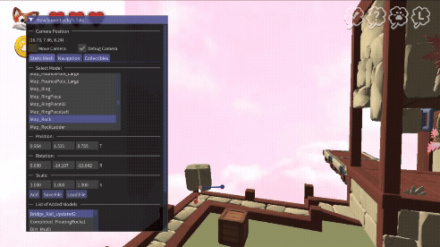
   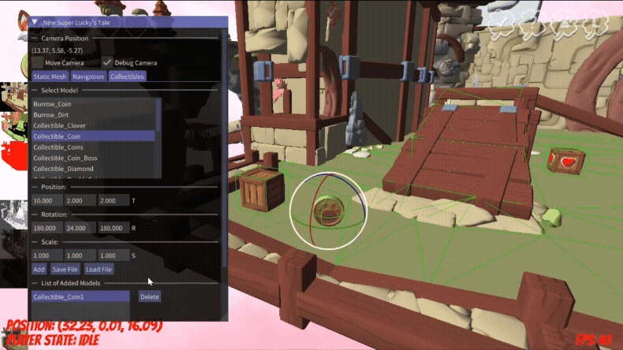

- **오브젝트 배치 및 편집 기능**: ImGui를 통한 위치, 회전, 스케일 조절
- **Collectibles 관리**: 코인 및 클로버 등 삭제/배치, 회전 애니메이션 구현, 점수 증가 기능 연동

   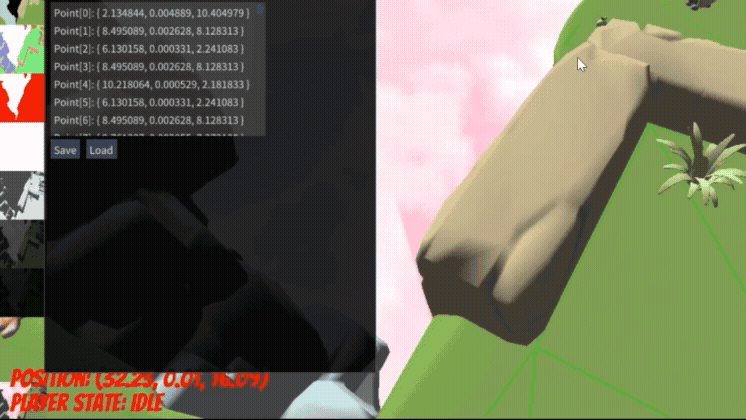

- **Navigation 포인트 설정**: AI 및 경로 탐색용 내비게이션 포인트 배치 가능
   - **삼각형(Cell) 생성**:  
  - 사용자가 3개의 포인트를 지정하면 하나의 삼각형 셀(Cell) 생성  
  - 삼각형의 정점은 Clockwise(시계방향) 순서로 자동 정렬

- **Snap 기능**:  
  - 이미 존재하는 네비게이션 포인트 근처에 점을 찍으면 자동으로 기존 점에 스냅  
  - Snap 반경: 0.3 유닛  
  - 이로 인해 여유 있게 포인트를 찍어도 삼각형이 깔끔하게 연결됨

- **Pixel Picking 기반 위치 계산**:  
  - 마우스 클릭 시 픽셀 좌표를 기반으로 월드 좌표 계산  
  - `_vector vPickedPos = XMVectorSetW(XMLoadFloat4(&m_pGameInstance->Get_PickedPos()), 1.f);`  
  - 계산된 위치를 `_float3` 형태로 변환 후 Snap 적용

- **시계방향 정렬(Clockwise Ordering)**:  
  - 삼각형 생성 시 정점 순서를 시계방향으로 정렬하여 렌더링 및 경로 탐색 안정성 확보  
  - `IsClockwise()` 함수로 벡터 외적을 이용해 방향 판단  
  - 필요 시 `_vec[1]`과 `_vec[2]`를 교환하여 시계방향 보장
   

---

### Gimmick Objects

   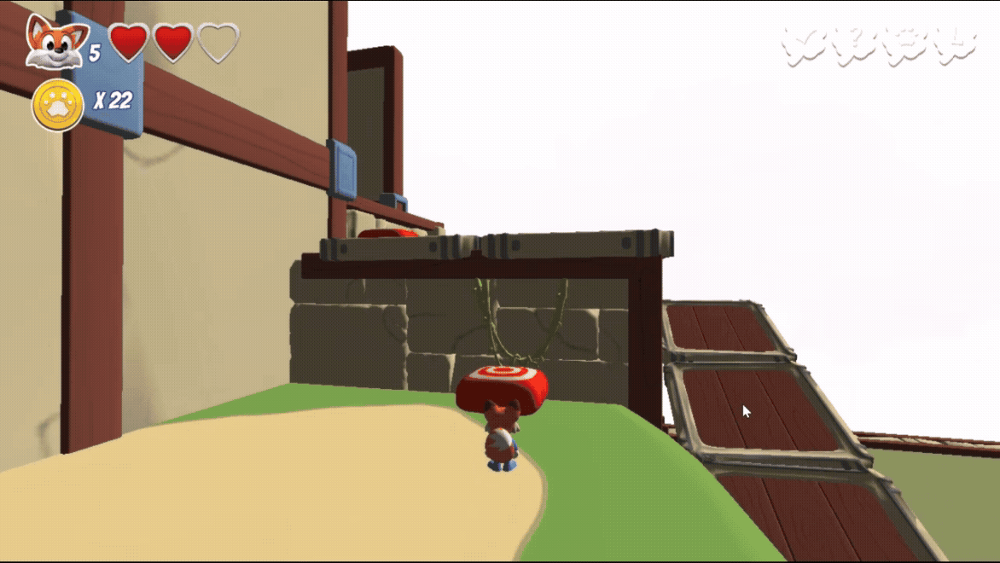
   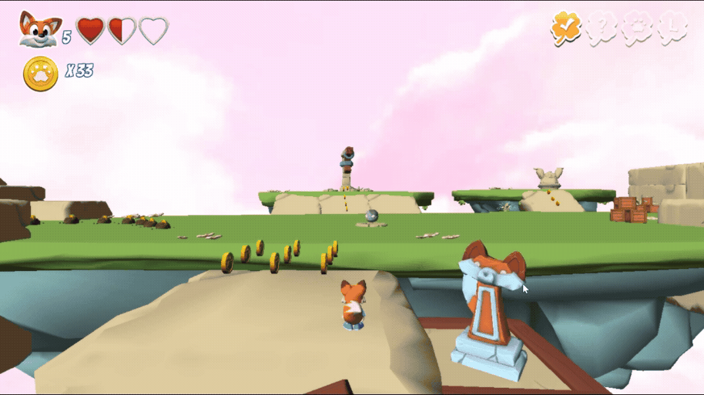
   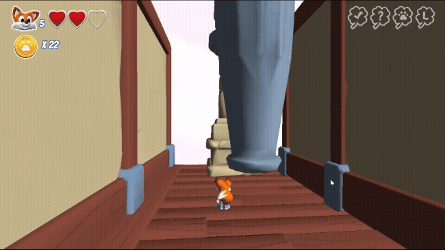
   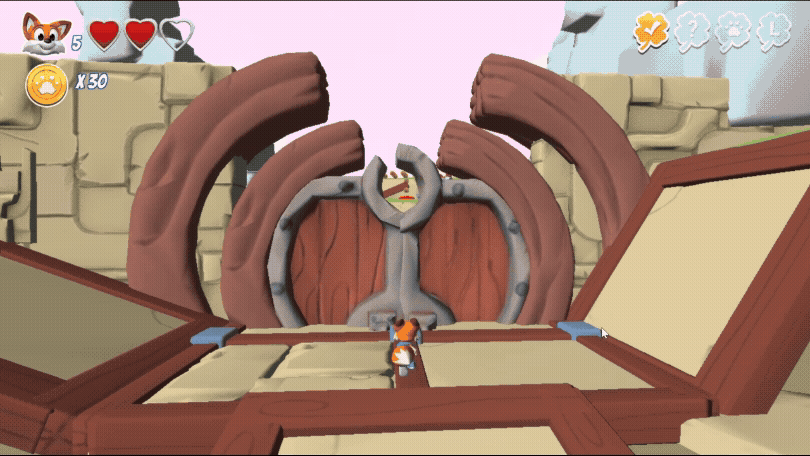

- **점프 패드(Jump Pad)**: 플레이어 콜라이더 충돌 시 스케일 변화 + Bouncing 효과 적용  
- **체크포인트(Checkpoint)**: 진입 시 애니메이션 및 이펙트 실행  
- **게이트(Entrance Gate)**: Blender로 pivot point를 문 끝으로 설정 후 직접 회전 구현, 문 열림 애니메이션 없음  
- **미로 벨 & 벽(Maze Bell & Wall)**: 종 이벤트 트리거로 벽 지진 효과와 이동 연출 구현  

---

### Monster AI

   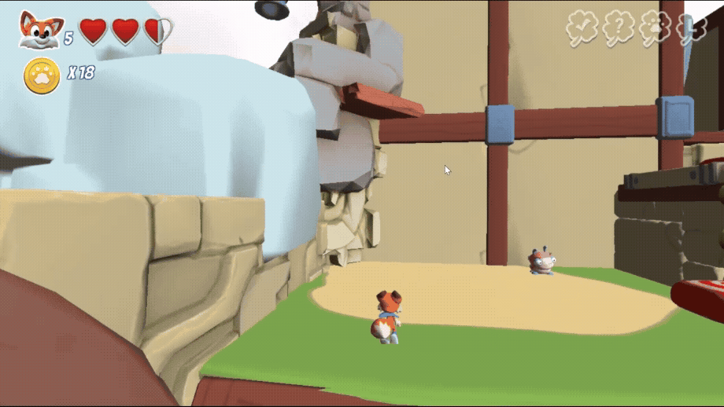

- **플레이어 추적 AI**: 단순 상태 머신(State Machine) 기반 동작 구현  
- **상태 전환(State Transition)**: Idle → 추적(Track) → 공격(Attack) → 피격(Reaction) 

---

## Rendering / Optimization

- Instancing 기반 렌더링 → 다수 오브젝트 성능 최적화
- Frustum Culling → 불필요한 드로우콜 제거

---
## 개발 환경
- Engine: DirectX11 기반 자체 엔진
- Language: C++
- IDE: Visual Studio
